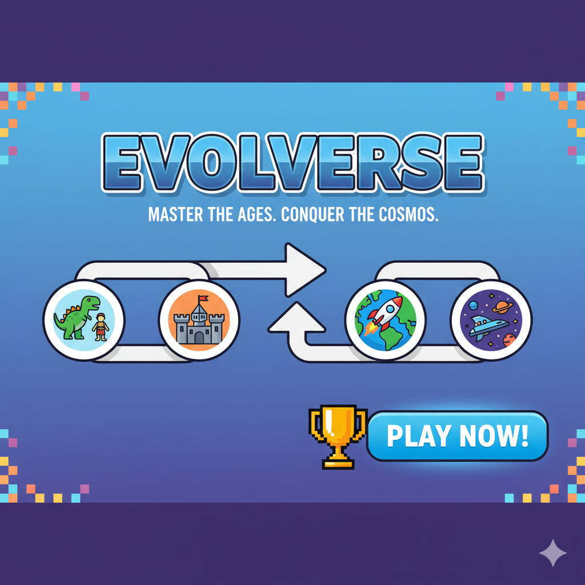
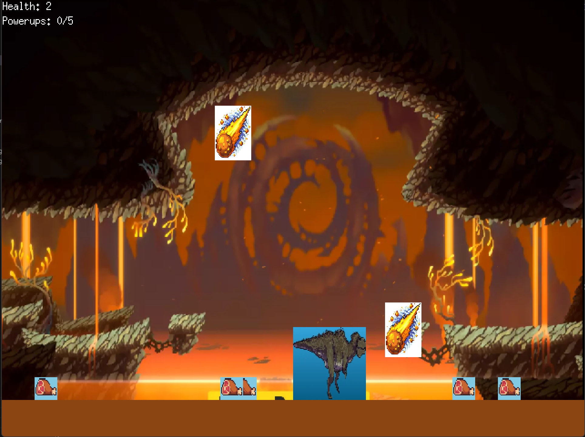
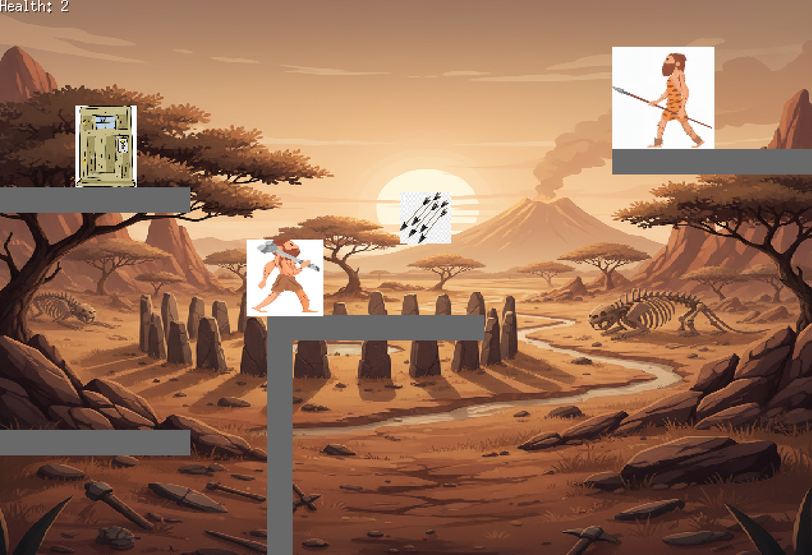
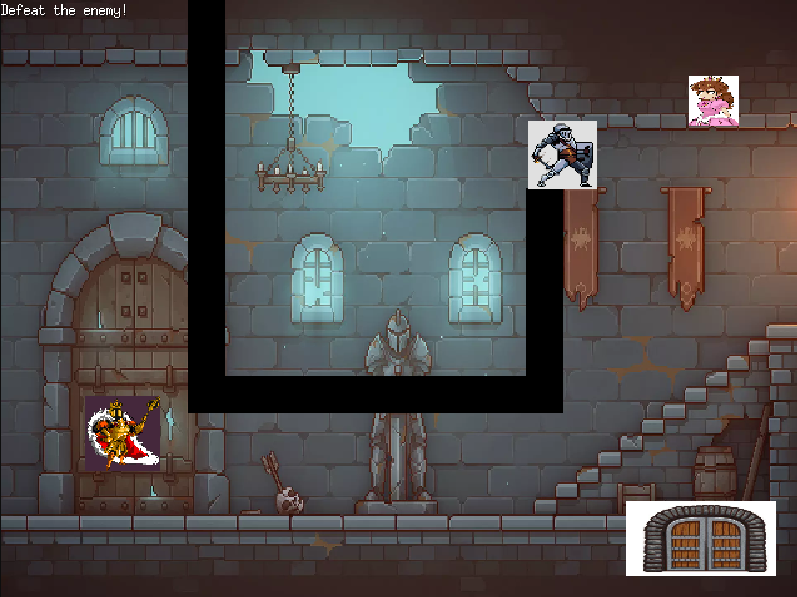
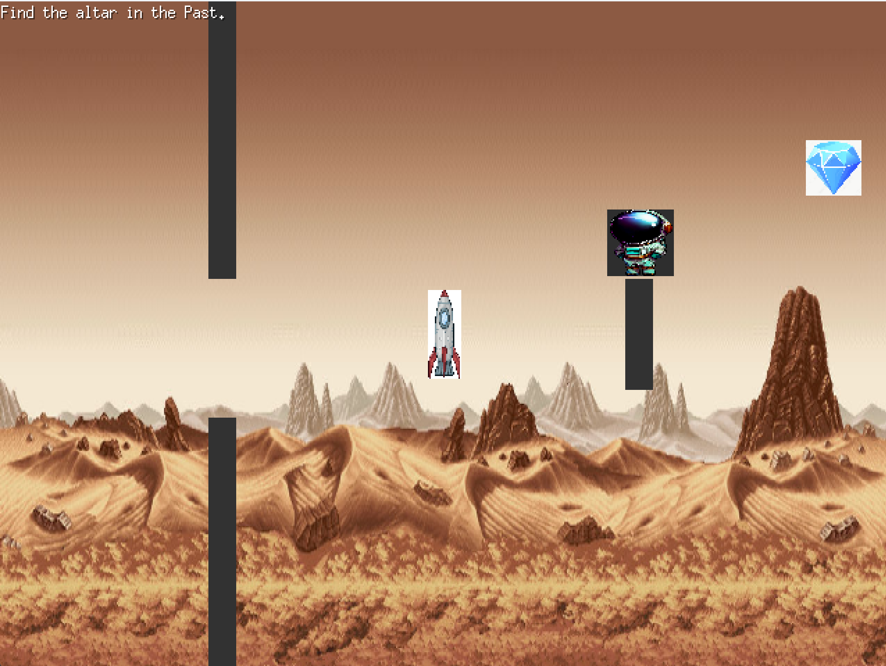
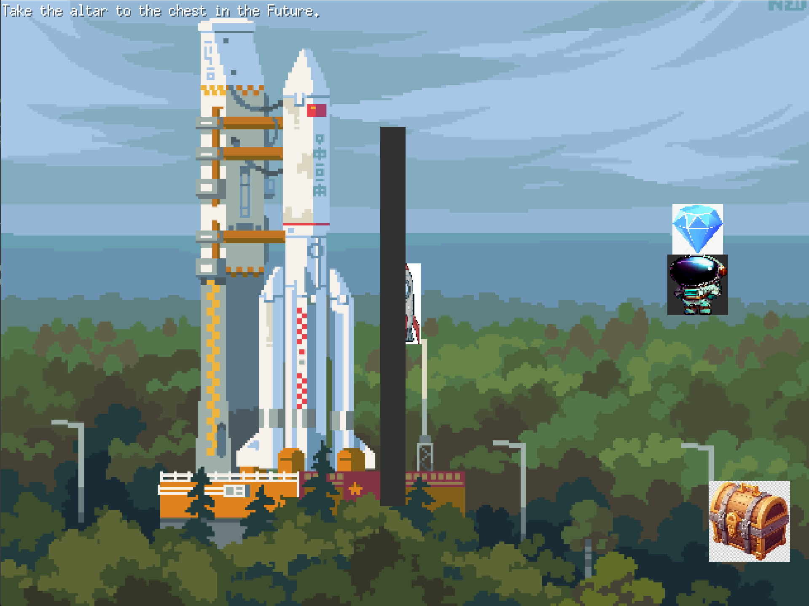

# Evolverse: The Dimensional Journey



Evolverse is a 2D adventure game built with Go and the Ebiten game library. It explores the concept of evolution through increasing dimensions of gameplay mechanics, symbolizing the progression of life and intelligence from simple primordial forms to advanced space exploration. Each level represents a "dimension" in gameplay complexity:

- **1D (Level 1: Primordial Path)**: Linear movement (left/right), representing basic survival instincts.
- **2D (Level 2: Dawn of Intelligence)**: Adds vertical movement (jumping), symbolizing the emergence of problem-solving.
- **3D (Level 3: Age of Empires)**: Full directional movement with interaction (fighting/rescuing), evoking societal and strategic depth (metaphorically 3D in complexity, implemented in 2D space).
- **4D (Level 4: Space-Time Frontier)**: Introduces time-shifting (past/future), representing mastery over time and space.

The game draws inspiration from evolutionary biology, where players guide a character through stages of "evolution" – from a dinosaur-like creature collecting resources while avoiding dangers, to a space explorer manipulating time. Loading screens transition between levels, enhancing the narrative of progression.

## Features
- Progressive difficulty and mechanics tied to dimensional concepts.
- Retro-style pixel art assets for characters, environments, bombs, power-ups, and more.
- Simple controls: Arrow keys/WASD for movement, Space for actions (jumping/attacking).
- Health systems, collectibles, enemies, and puzzles in each level.
- Game over and reset mechanics for replayability.

## Installation
To run the game locally:

1. Ensure you have Go installed (version 1.16+ recommended).
2. Clone the repository:
   ```
   git clone https://github.com/yourusername/evolverse.git
   cd evolverse
   ```
3. Install dependencies (Ebiten and other imports are handled via Go modules):
   ```
   go mod tidy
   ```
4. Download or ensure the asset files are in place (e.g., images in `assets/` directory as referenced in the code).

## Usage
Run the game with:
```
go run main.go
```
- Window size: 1280x960 (scaled 2x from internal 640x480 resolution).
- Controls:
  - Left/Right (A/D or Arrow keys): Move horizontally.
  - Up/Down (W/S or Arrow keys): Move vertically (in higher levels).
  - Space: Jump (Level 2+), Attack (Level 3).
- Objective: Complete each level to progress. Collect items, avoid/dodge hazards, defeat enemies, and reach goals.
- The game loops back after completion or restarts on game over.

## Gameplay Overview
The game starts with a loading screen and cycles through levels with transitions. Each level builds on the previous, adding mechanics to represent dimensional evolution.

### Level 1: Primordial Path (1D - Linear Survival)
A dinosaur-like creature moves left/right on a prehistoric ground, collecting meat power-ups (5 required to win) while avoiding falling meteors (bombs). 3 lives; collision with meteors reduces health.

- **Movement**: Horizontal only (playerX adjusted by speed=4.0).
- **Mechanics**: Random power-up/bomb spawns; collision detection via bounding rectangles.
- **Completion**: Collect 5 power-ups.
- **Technical**: Uses random seeding for spawns; simple update loop for falling bombs.



### Level 2: Dawn of Intelligence (2D - Platforming & Dodging)
A prehistoric human jumps over obstacles and dodges projectiles from an enemy to reach a monolith door. Includes gravity, jumping, and projectile aiming.

- **Movement**: Horizontal + Jumping (velocity-based with gravity=0.6, jump=-12.0).
- **Mechanics**: Platforms as collision barriers; enemy shoots targeted projectiles every 120 frames; health system (3 lives).
- **Completion**: Reach the monolith (altar).
- **Technical**: Physics simulation (velocity updates); normalized direction vectors for projectile aiming; platform collision resolution.



### Level 3: Age of Empires (3D - Combat & Escort)
A medieval king fights a knight (enemy), rescues a princess (ally), and escorts her to a monolith exit. Full movement with obstacles.

- **Movement**: Full directional (speed=3.0).
- **Mechanics**: Enemy chases player; spacebar attack (cooldown=60 frames, range=40); ally follows after rescue; obstacles block paths.
- **Completion**: Escort ally to exit after defeating enemy.
- **Technical**: Pathfinding-like chasing (normalized vectors); attack timer; following AI for ally (maintain distance >50).



### Level 4: Space-Time Frontier (4D - Time Manipulation)
A space explorer shifts between past/future via a rocket monolith, collects an altar item in the past, and deposits it in a chest in the future. Walls change per time state.

- **Movement**: Full directional (speed=3.0).
- **Mechanics**: Time toggle on monolith overlap; item pickup/follows player; dynamic walls per era.
- **Completion**: Drop item in future chest.
- **Technical**: State machine for time (Past/Future); conditional rendering/collisions; item attachment to player.




## Gameplay Video
Watch a full playthrough:


## Technical Details
- **Tech Stack**:
  - **Language**: Go (for its simplicity and performance in game loops).
  - **Game Engine**: Ebiten v2 (handles rendering, input, and window management; uses OpenGL under the hood for cross-platform support).
  - **Assets**: PNG images loaded via `ebitenutil.NewImageFromFile`; scaled and drawn with `DrawImageOptions` for transformations (scaling, translation).
  - **Dependencies**: Standard Go libraries (`log`, `time`, `math/rand`, `image/color`) + Ebiten.
- **Architecture**:
  - **Main Loop**: `Game` struct manages scenes (levels/loading) via an interface (`Scene` with Update/Draw/IsDone).
  - **State Management**: Levels use structs with fields for positions, velocities, timers, and flags. Updates handle input, physics, collisions (bounding box overlaps), and logic.
  - **Rendering**: Background scaling to fit screen; entity drawing with geometric transformations to match logical sizes.
  - **Physics/Collisions**: Simple AABB (Axis-Aligned Bounding Boxes) for overlaps; velocity-based movement with gravity in Level 2.
  - **Randomness**: Seeded with `time.Now()` for bomb/power-up spawns.
  - **Evolution Concept**: Levels increase in "dimensional" freedom – from 1D constraints to 4D time manipulation – mirroring biological/technological evolution.
- **Code Structure**:
  - `main.go`: Entry point, game loop, level transitions.
  - `levelX.go`: Individual level logic, with `NewLevelX()` factories.
  - Assets referenced in `assets/` paths (e.g., backgrounds, characters).
- **Performance**: Runs at 60 FPS via Ebiten; lightweight with no external deps beyond Ebiten.

## Contributing
Contributions are welcome! Fork the repo, make changes, and submit a pull request. Focus areas: Bug fixes, new levels, improved assets, or mobile support.

## License
This project is licensed under the MIT License - see the [LICENSE](LICENSE) file for details.

---

Created by [Ruthan]. Inspired by evolutionary games and dimensional puzzles.
